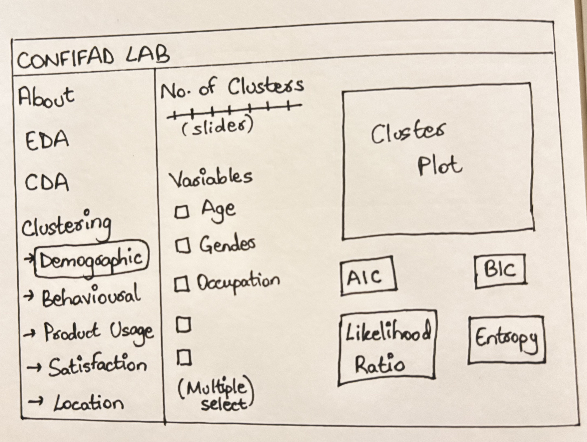

# Introduction

The **CONFIFAD LAB** Shiny application is an interactive analytics environment designed to explore Colombian Financial Behaviour and Trends using real customer-level data from a fintech company.

The Clustering module segments customers into meaningful groups based on demographics, transactional behaviours, product usage, satisfaction, and location (city)-based patterns, enabling analysts to uncover how these factors shape financial behaviour in Colombia.

# Objectives

This exercise focuses on the following aspects of the Clustering Module of CONFIFAD LAB:

-   Evaluating and determining the necessary R packages needed for your Shiny application are supported in R CRAN,

-   Preparing and testing the specific R codes that can be run and returning the correct visual output as expected,

-   Determining the parameters and outputs that will be exposed on the Shiny applications, and

-   Selecting the appropriate Shiny UI components for exposing the parameters determine above.

# Getting Started

## Packages Required

| Package | Purpose | Justification for Shiny/CRAN |
|------------|------------------|-------------------------------------------|
| **tidyverse** | Data manipulation | Essential for the reactive data flows in Shiny. |
| **cluster** | Clustering: `clara()` algorithm | **Critical:** Unlike `pam()`, `clara()` is optimized for \>40k rows, avoiding memory crashes. |
| **factoextra** | Visualization | Best-in-class for PCA-based cluster plots and Elbow/Silhouette methods. |
| **fpc** | Validation | Used to calculate Entropy and cluster stability. |
| **treemap** | Static Hierarchical View | Allows for a "nested" look at how behavioral clusters sit within Planning Regions/Locations. |

## Installing and Loading Required Libraries

```{r}
pacman::p_load(tidyverse, cluster, factoextra, fpc, treemap)
```

## Importing and Loading Dataset

The application is built using the [COFINFAD: Colombian Fintech Financial Analytics Dataset](https://data.mendeley.com/datasets/mhb4zn3258/1), which contains 12‑month transactional and demographic information for 48,723 customers of a Colombian fintech company. The data include 57 variables covering demographics (age, gender, occupation), product portfolio (savings, credit cards, loans, insurance), transaction frequency and value, satisfaction and Net Promoter Score, app‑usage metrics, and city of residence (Bogotá, Medellín, Cali, Barranquilla, and others).

```{r}
df <- read_csv("data/confinad/customer_data.csv")
colnames(df)
```

## Data Preparation

Before moving to the clustering, the data is cleaned by first removing five transactional summary columns (`average_transaction_value`, `total_transaction_volume`, `first_transaction_date`, `last_transaction_date`, `transaction_frequency`) that are redundant. Then any rows containing missing values across the remaining variables are removed using `na.omit()`.

Finally, all character columns (such as gender, occupation, or city) are converted to factors using `mutate(across(where(is.character), as.factor))`, ensuring compatibility with Gower distance calculations required by the CLARA algorithm for mixed numeric-categorical data in demographic and product usage clustering modules. 

```{r}
#| code-fold: true
#| code-summary: "Show the code"
# Deduplication and Selection
df_clean <- df %>%
  select(-c("average_transaction_value", "total_transaction_volume", 
            "first_transaction_date", "last_transaction_date", "transaction_frequency")) %>%
  na.omit()

# Handling Characters for Gower Distance
df_clean <- df_clean %>%
  mutate(across(where(is.character), as.factor))
```

# Clustering Analysis

The Clustering module helps identify homogeneous customer segments based on five perspectives: Demographic, Behavioral and Transactional, Product Usage, Satisfaction and Engagement, and Location‑based Transcation behaviour.

It provides an interactive environment where users can choose clustering type, variables, and number of cluster, and immediately visualise the resulting segments. It also displays cluster plots and quality metrics (AIC, BIC, likelihood ratio, entropy) to support evidence‑based selection of the “best” segmentation.

Based on the variables used for each of the clustering type, the method varies due to their different data types.

For the **Behavioural/Transactional** and **Satisfaction/Engagement** modules, the variables are purely numeric (e.g., transaction volume, NPS scores, ticket counts), hence **K-Means** is more suitable.

-   **Mathematical Fit:** K-means is designed for Euclidean space, making it highly efficient at finding centers of "gravity" in numeric data.

-   **Scalability:** With 48,723 rows, the `stats::kmeans()` function is computationally fast, allowing for the "reactive" updates required in a Shiny environment without lag.

-   For the these modules the metrics tocalculate, **AIC** and **BIC** are based on the Total Within-Cluster Sum of Squares (TSS).

The **Demographic** and **Product Usage** data contain "Mixed Data" (Age is numeric, but Gender and Occupation are categorical) and "Binary Data" (Yes/No product ownership).

-   **The Problem with K-Means:** K-means cannot handle categorical strings directly and calculating the "mean" of a binary flag (e.g., 0.5 for a Credit Card) often yields nonsensical results.

-   **The CLARA Advantage:** We selected **CLARA (Clustering Large Applications)** because it is built upon the **PAM (Partitioning Around Medoids)** logic. Instead of means, it uses *medoids* (actual representative data points).

-   **Gower Distance:** When paired with the Gower metric, CLARA can simultaneously calculate the distance between a number (Age) and a category (Occupation).

-   **Memory Efficiency:** While PAM requires a distance matrix that would crash R at 48k rows, CLARA uses a sampling approach to provide the same accuracy with a fraction of the RAM.

-   For these modules, the metric to calculate is **Average Silhouette Width** because medoid-based clustering is distance-agnostic, making AIC/BIC less representative.

To obtain the clusters for Location-based Transaction behaviour, **K-means + Treemap** is used.

-   **Purely numeric features**: Transaction volume/counts/login frequency work perfectly with Euclidean distance (no categorical variables like demographics).

-   **Scalability**: Handles 48k rows efficiently for real-time Shiny reactivity.

-   **Interpretable segments**: Produces clean behavioral groups (high-spenders, frequent users, etc.) before geographic mapping.

-   **Geographic discovery**: Treemaps excel at showing hierarchical patterns—e.g., "Young Digital" customers dominate Bogotá while "High-Value Seniors" concentrate in Medellín.

-   **No dendrogram needed**: Unlike pure hierarchical clustering of cities, this reveals customer distribution patterns across locations rather than city-to-city similarity.

-   For the **Location-based** module, the ***fpc*** package is used to calculate **Entropy** or cluster stability.

|  |  |  |
|----------------|----------------|----------------------------------------|
| **Clustering Option** | **Primary Metric** | **Justification** |
| Behavioral and Transactional | AIC / BIC | K-Means is variance-based; RSS is a valid likelihood proxy. |
| Satisfaction and Engagement | AIC / BIC | High-speed validation for numeric sentiment data. |
| Demographic | Silhouette Width | Gower distance (used in CLARA) doesn't have a "Mean," so Silhouette measures fit better. |
| Product Usage | Silhouette Width | Better at measuring separation in binary/sparse data. |
| Location-based Transaction behaviour | Entropy | Measures how well customers fit their behavioral segments (high = good separation) |

## Demographic Clustering

-   **Technique:** CLARA with Gower Distance.

-   **Why:** Handles mixed numeric (Age) and categorical (Gender, Location) data efficiently.

```{r}
#| fig-align: "center"
demo_data <- df_clean[, c("age", "gender", "occupation", "income_bracket", "education_level", "marital_status", "household_size")] #input$cluster_vars

set.seed(123)
demo_res <- clara(demo_data, k = 4, samples = 50, pamLike = TRUE) #input$DemoC, input$k_clusters

fviz_cluster(demo_res, geom = "point", pointsize = 1, main = "Demographic Segments") #output$cplot
```

```{r}
# Calculate Silhouette Width
avg_sil_demo <- demo_res$silinfo$avg.width
avg_sil_demo #output$entropy_box
```

## Behavioral and Transactional Clustering

-   **Technique:** K-Means on Scaled Data.

-   **Why:** Fast execution for purely numeric metrics.

```{r}
#| fig-align: "center"
trans_vars <- c("tx_count", "avg_tx_value", "total_tx_volume", 
                "avg_daily_transactions", "credit_utilization_ratio", 
                "international_transactions", "failed_transactions", "weekend_transaction_ratio") #input$cluster_vars

trans_data <- na.omit(df[, trans_vars])
trans_scaled <- scale(trans_data)

set.seed(123)
trans_km <- kmeans(trans_scaled, centers = 5, nstart = 25) #input$TransC, input$k_clusters

fviz_cluster(trans_km, data = trans_scaled, ellipse.type = "norm", main = "Behavioral Segments") #output$cplot
```

```{r}
k_trans <- nrow(trans_km$centers)
n_trans <- nrow(trans_scaled)

#output$stat_boxes
aic_trans <- trans_km$tot.withinss + 2 * k_trans * ncol(trans_scaled)
bic_trans <- trans_km$tot.withinss + log(n_trans) * k_trans * ncol(trans_scaled)

print(paste("AIC:", aic_trans))
print(paste("BIC:", bic_trans))
```

## Product Usage Clustering

-   **Technique:** CLARA (Binary handling).

-   **Why:** Distinguishes between "Yes/No" product ownership profiles without the Euclidean distance bias of K-means.

```{r}
#| fig-align: "center"
usage_vars <- c("active_products", "app_logins_frequency", "feature_usage_diversity", 
                "bill_payment_user", "auto_savings_enabled", "insurance_product", 
                "credit_card", "personal_loan", "savings_account", "investment_account") 
#input$cluster_vars

usage_data <- df[, usage_vars]
usage_data[] <- lapply(usage_data, as.factor)

set.seed(123)
usage_res <- clara(usage_data, k = 3, samples = 50) #input$UseC, input$k_clusters

fviz_cluster(usage_res, geom = "point", main = "Product Usage Segments") #output$cplot
```

```{r}
# Calculate Silhouette Width
avg_sil_usage <- usage_res$silinfo$avg.width
print(paste("Silhouette width:", avg_sil_usage))  #output$entropy_box
```

## Satisfaction and Engagement Clustering

-   **Technique:** K-Means.

-   **Focus:** Segmenting customers by NPS and Support Ticket frequency.

```{r}
#| fig-align: "center"
sat_vars <- c("base_satisfaction", "tx_satisfaction", "product_satisfaction", 
              "satisfaction_score", "nps_score", "support_tickets_count", 
              "resolved_tickets_ratio", "app_store_rating") #input$cluster_vars

sat_data <- df_clean[, sat_vars]
sat_scaled <- scale(na.omit(sat_data))

set.seed(123)
sat_km <- kmeans(sat_scaled, centers = 3, nstart = 25) #input$SatC, input$k_clusters

fviz_cluster(sat_km, data = sat_scaled, main = "Satisfaction Segments") #output$cplot
```

```{r}
k_sat <- nrow(sat_km$centers)
n_sat <- nrow(sat_scaled)

#output$stat_boxes
aic_sat <- sat_km$tot.withinss + 2 * k_sat * ncol(sat_scaled)
bic_sat <- sat_km$tot.withinss + log(n_sat) * k_sat * ncol(sat_scaled)

print(paste("AIC:", aic_sat))
print(paste("BIC:", bic_sat))
```

## Location-based Clustering

**Technique:** K-Means (at the individual level) + Geographic Faceting.

**Objective:** To identify location-specific behavioral segments.

To do this effectively for 48,000+ rows, we cluster the customers based on their transactions first, and then visualize the **density** of those clusters across different locations.

```{r}
#| code-fold: true
#| code-summary: "Show the code"
#| fig-align: "center"
cluster_data <- df_clean %>%
  select(customer_id, total_tx_volume, tx_count, app_logins_frequency) %>%
  drop_na() %>%
  mutate(across(-customer_id, scale)) 

set.seed(123)
kmeans_result <- kmeans(cluster_data[,-1], centers = 4) #input$k_clusters
cluster_data$segment_id <- as.factor(kmeans_result$cluster)

final_df <- df_clean %>%
  inner_join(select(cluster_data, customer_id, segment_id), by = "customer_id")

segment_summary <- final_df %>%
  group_by(segment_id) %>%
  summarise(
    avg_age = round(mean(age, na.rm = TRUE), 1),
    # Finding the most frequent income bracket
    top_income = names(sort(table(income_bracket), decreasing = TRUE))[1],
    avg_vol = round(mean(total_tx_volume, na.rm = TRUE), 0)
  ) %>%
  
  mutate(persona = case_when(
    segment_id == 1 ~ "Young Digital",
    segment_id == 2 ~ "Affluent Professional",
    segment_id == 3 ~ "Mass Market",
    segment_id == 4 ~ "High-Value Senior",
    TRUE ~ as.character(segment_id)
  ))

tree_prep_labeled <- final_df %>%
  group_by(location, segment_id) %>%
  summarise(total_vol = sum(total_tx_volume, na.rm = TRUE), .groups = 'drop') %>%
  left_join(segment_summary, by = "segment_id") %>%
  mutate(label_text = paste0(persona, "\nAvg Age: ", avg_age))

treemap(tree_prep_labeled,
        index = c("location", "label_text"), 
        vSize = "total_vol",
        vColor = "location",
        type = "index",
        title = "Geographic Segments by Persona & Age (CONFIFAD)",
        palette = "Set3",
        fontsize.labels = c(15, 8),          
        fontcolor.labels = c("black", "darkslategrey"),
        border.col = c("black", "white"),
        border.lwds = c(4, 1),
        align.labels = list(c("center", "center"), c("left", "top"))) #output$treemap
```

```{r}
# Calculate Cluster Stability/Entropy
cluster_stats <- cluster.stats(dist(cluster_data[,-1]), kmeans_result$cluster)
entropy_val <- cluster_stats$entropy 
print(paste("Entropy:", entropy_val)) #output$entropy_box
```

# Story Board

{fig-align="center"}

**Left‑hand navigation:** A vertical menu lists the main modules of CONFIFAD LAB (About, EDA, CDA, Clustering), with the Clustering section expanding into five sub‑tabs: Demographic, Behavioural, Product Usage, Satisfaction, and Location. This can be done using `menuItem().`

**Clustering controls panel (centre‑left):**

-   A `sliderInput` component lets the user choose the desired **number of clusters `input$k_clusters`**, typically from 2 to 10.​

-   A **Variables** `input$cluster_vars` checklist shows the relevant fields for the selected clustering type (e.g., age, gender, occupation for Demographic), and users can multi‑select to customise the model, using `checkboxGroupInput`.

**Main visualisation panel (centre‑right):** Displays the **Plot Output** `plotOutput`. By using `output$cplot` for the PCA visualization via `fviz_cluster()`, and `output$treemap` for the location segments, the user gets a modern, interactive experience.

**Model‑quality metrics area (bottom):**

-   `valueBoxOutput` displaying AIC and BIC for K-Means modules `output$stat_boxes` and `output$entropy_box` for Entropy or Silhouette Width to measure cluster separation.

-   When the user changes the number of clusters or variables, these metrics and the plot update dynamically, supporting rapid comparison of alternative segmentation.

# Shiny UI Components

|  |  |  |  |
|----------------|-------------------|----------------------|---------------|
| **Function/Object in R** | **Feature** | **UI Component** | **Server Function** |
| `kmeans()` / `clara()` | **Cluster Resolution**: Allows users to define the granularity of segments. | `sliderInput("k_clusters", ...)` | `renderPlot()` / `renderTree()` |
| `select()` / `subset()` | **Feature Engineering**: Dynamic selection of variables for the model. | `checkboxGroupInput("cluster_vars", ...)` | `reactive()` to filter the dataframe. |
| `fviz_cluster()` | **PCA Visualisation**: Projecting high-dimensional data onto 2D. | `plotOutput("pca_plot")` | `renderPlot()` using `factoextra`. |
| `treemap()` | **Hierarchical View**: Nested Location \> Cluster relationship. | `plotOutput("treemap_plot")` | `renderPlot()` using `treemap` pkg. |
| `tot.withinss` / `ncol` | **AIC & BIC**: Statistical model fit indices based on the sketch. | `valueBoxOutput("stat_boxes")` | `renderValueBox()` via `shinydashboard`. |
| `cluster::silhouette()` | **Entropy / Stability**: Measures how well objects fit in their clusters. | `valueBoxOutput("entropy_box")` | `renderValueBox()` via `fpc` pkg. |
| `set.seed()` | **Result Stability**: Prevents clusters from "shifting" on every refresh. | Hidden Logic | `observeEvent()` or `reactive()`. |

# References

Kam, T.S. (2023). [Treemap Visualisation with R](https://r4va.netlify.app/chap16)

Murphy, P. (2021) [Clustering Data in R](https://rpubs.com/pjmurphy/599072)

[Shiny Components](https://shiny.posit.co/r/components/)

[Tidyverse Package](https://tidyverse.org/)

[cluster: "Finding Groups in Data": Cluster Analysis Extended Rousseeuw et al](https://cran.r-project.org/web/packages/cluster/index.html)

[factoextra: Extract and Visualize the Results of Multivariate Data Analyses](https://cran.r-project.org/web/packages/factoextra/index.html)

[fpc: Flexible Procedures for Clustering](https://cran.r-project.org/web/packages/fpc/index.html)

[treemap: Treemap Visualization](https://cran.r-project.org/web/packages/treemap/index.html)
